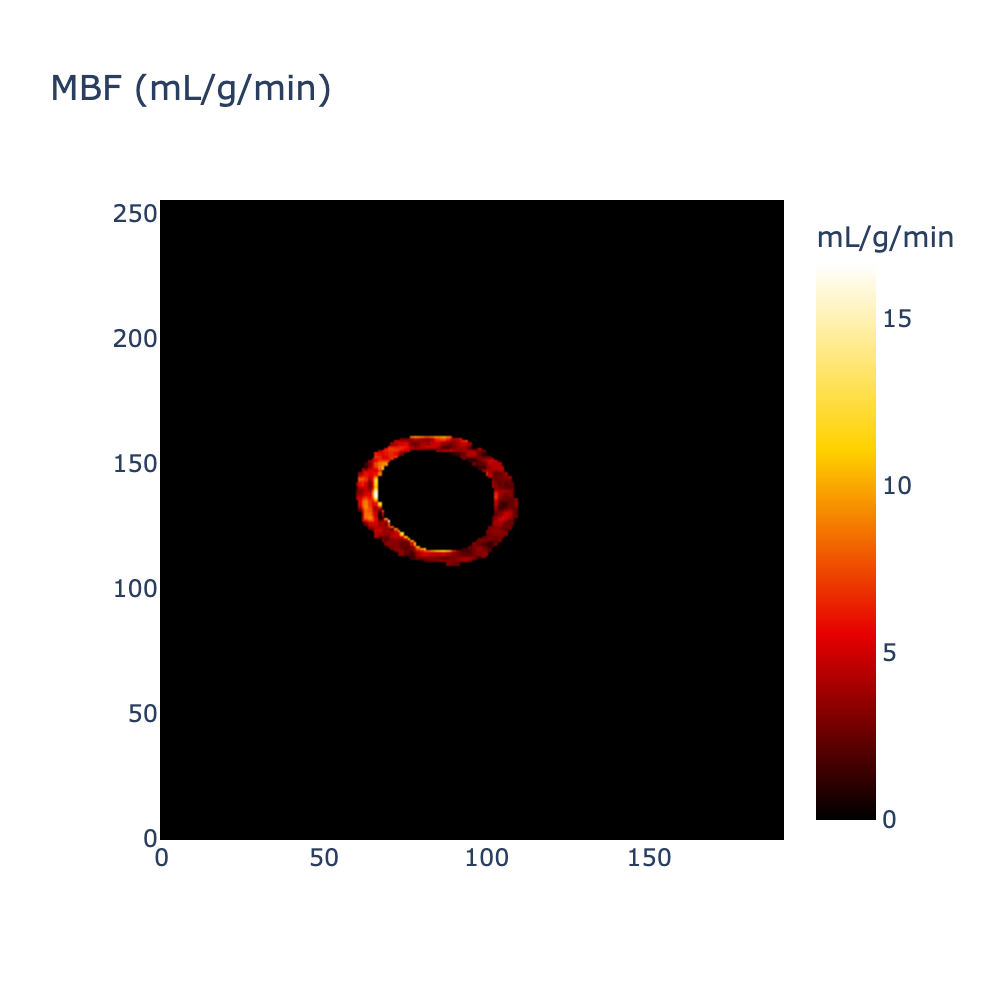
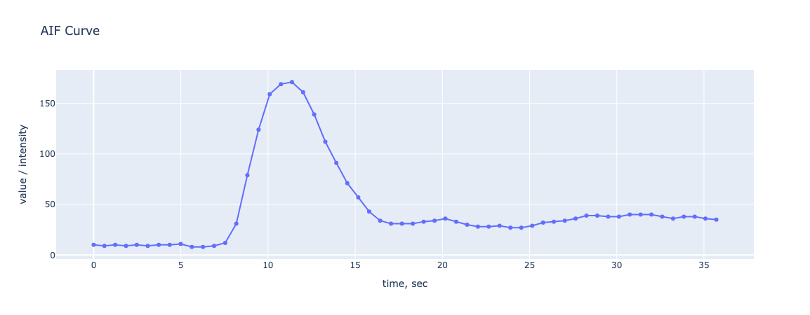
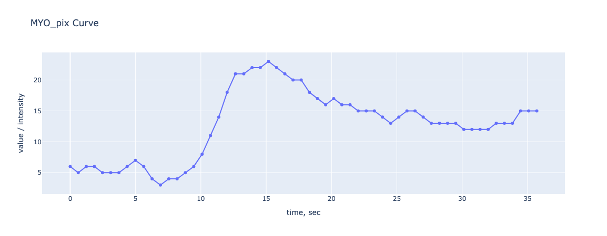
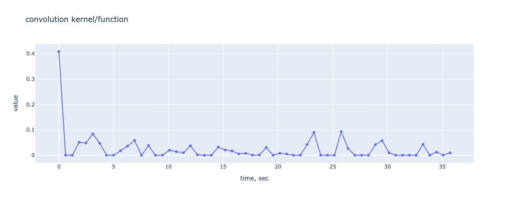
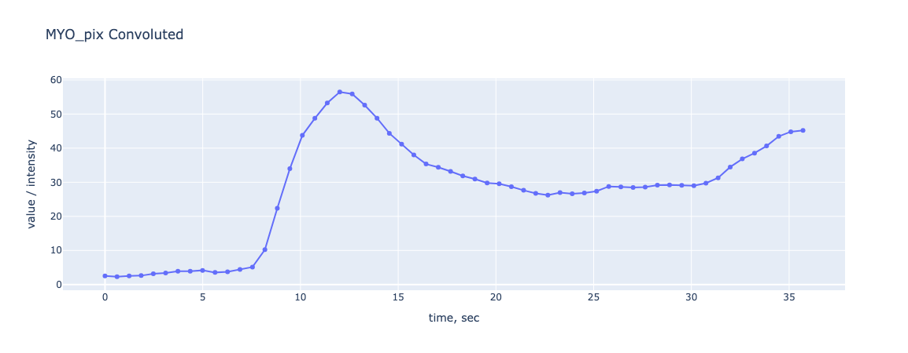
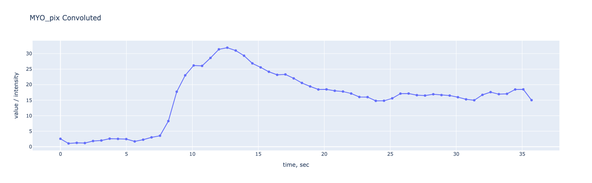
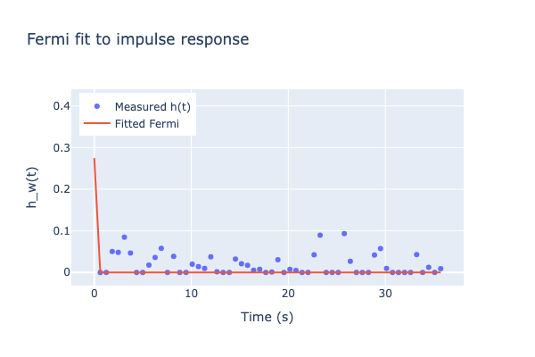
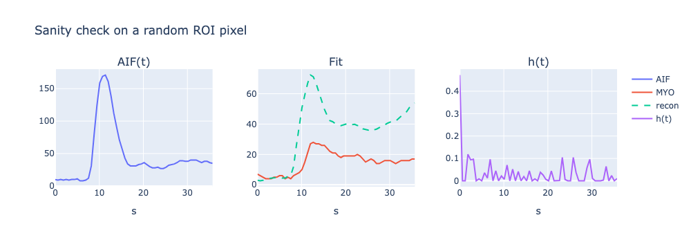
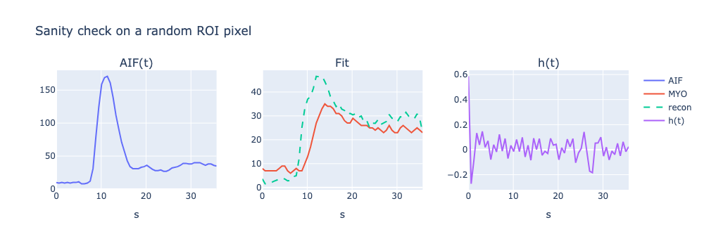

# MBF mapper

This package can be used to estimate myocardial perfusion and visualise corresponding map:




<!-- ### Input

Perfusion DICOM series, blood pool (e.g. left ventricle) & Myocardium segmentation masks:

  

Blood pool (e.g. left ventricle) & Myocardium segmentation masks: -->


## Installation

The package can be installed by:

```
pip install -e .
```

## Usage
Ensure that MotionCorrectedPerfusionSeries/ and AIF_And_Myo_Masks.tiff are placed into ./data/ directory. Then, run:

```
python ./examples/demo.py
```

## CLI

After installation mpf-mapper can be used by CLI:

```
mpf-mapper --dcm_series ./data/MotionCorrectedPerfusionSeries/ \
           --tiff_masks ./data/AIF_And_Myo_Masks.tiff \
           --vis_check
```

Run pytests to ensure that it works as expected:

```
pytest
```

## How it works

1) AIF curve is extracted based on average SI(signal intensity) change over time:



2) MYO(t) is extracted for each pixel of myocardium (defined by segmentation mask in *.tiff files). Here is an example for one of pixels:



3) Defining tissue impulse response function h(t) by applying deconvolution (e.g. Wiener). Here is an example for one of pixels:



if h(t) applyed to AIF reconstructed MYO(t) is:



and without zero-clipping for h(t):



The shape is quite similar to the original MYO(t) for both cases, but amplitude is ~2 times higher when zero-clipping is applied.

4) Defining Fermi model parameters that correspond observed dynamics of perfussion. Example for one of pixels:



5) Converting F(0) to mL/g/min and grouping results into a map. Only initial response is used as it is the most representative of immediate perfusion dynamics.

6) Sanity check for one of a random pixel (TBD since curves don't match):



without applying zero-clipping to the impulse response function:




## C++ implementation

Build and run:

```
cd cpp
mkdir build
cd build
cmake -DITK_DIR=~/ITK/build ..          
make 

./mbf_cli ../../data/MotionCorrectedPerfusionSeries/ ../../data/AIF_And_Myo_Masks.tiff ../mbf_map.png
```