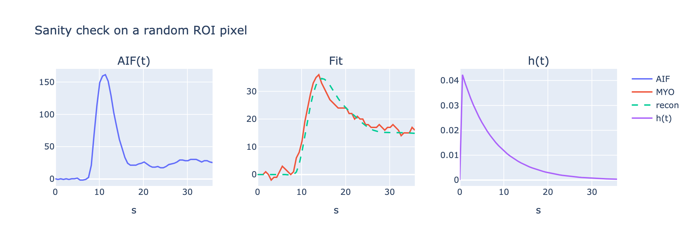
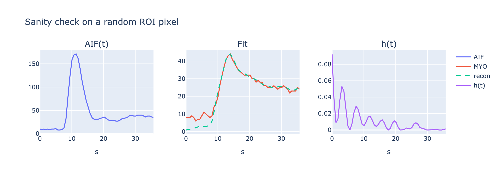

# MBF mapper

This package can be used to estimate myocardial perfusion and to visualise corresponding map:


<!-- ### Input

Perfusion DICOM series, blood pool (e.g. left ventricle) & Myocardium segmentation masks:

  

Blood pool (e.g. left ventricle) & Myocardium segmentation masks: -->

## Compile

Link and build:

```
mkdir build
cd build
cmake -DITK_DIR=~/ITK/build ..          
make 
```

## Usage
Ensure that MotionCorrectedPerfusionSeries/ and AIF_And_Myo_Masks.tiff are placed into ./data/ directory. Then, run:

```
./mbf_cli ../data/MotionCorrectedPerfusionSeries/ ../data/AIF_And_Myo_Masks.tiff ../mbf_map.nii
```

### Sanity check for one of pixels

```
# install dependencies if needed
python vis_check.py
```

h(t) - was defined by deconvolution (SVD) or Fermi model; impulse response function

MYO - concentration of contrast agent at a specific pixel/voxel

recon - reconstruction of MYO obtained by convoluting AIF and h(t)



### MBF calculation (in ml/min/gr)
MBF for this particular pixel was calculated based on h(0) value by the following logic:

```
# tissue density:
const double rho = 1.05

# dt - time difference between neighbouring images/slices (0th and 1st)

double mbf = (h0 / dt) * 60.0 / rho;
```

### MBF map

The defined MBF map is written to mbf_map.nii . It can be displayed in Slicer3D, Python(SimpleITK & Plotly) or by other visualisational tools.


### Incorrect h(t) when using deconvolution

Since h(t) contains oscilation (not decaying continiously) it doesn't represent targeted physiological process


